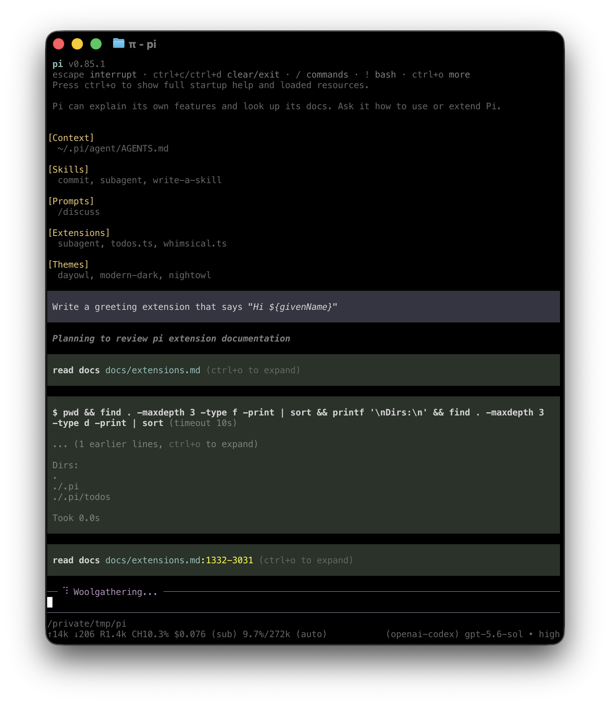

# Pi

Install and configure the [Pi](https://pi.dev/) coding agent CLI in your workspace.
Pi is a customizable terminal coding agent harness built by [earendil-works](https://github.com/earendil-works/pi).
The module installs and configures the CLI; starting Pi is left to a `coder_app`, an IDE launcher, or a custom `coder_script`.

```tf
module "pi" {
  source            = "registry.coder.com/coder-labs/pi/coder"
  version           = "1.0.0"
  agent_id          = coder_agent.main.id
  enable_ai_gateway = true
}
```



## Prerequisites

The module installs Pi with `npm install -g @earendil-works/pi-coding-agent` into a user-owned prefix (`~/.coder-modules/coder-labs/pi/npm-global`), so it never needs `sudo` or a writable global npm prefix.
The workspace image must already have Node.js (>= 22.19.0), npm, and `jq`.
To skip the npm install entirely, see [Bring your own Pi binary](#bring-your-own-pi-binary).

## Authentication

Choose one of the following paths.
They are listed from most to least centrally managed.

| Path                                          | Raw keys in the template | Configure with                                                       |
| --------------------------------------------- | ------------------------ | -------------------------------------------------------------------- |
| [Coder AI Gateway](#ai-gateway) (recommended) | No                       | `enable_ai_gateway = true`                                           |
| [Interactive `/login`](#interactive-login)    | No                       | Nothing; users sign in from inside Pi                                |
| [Provider API keys](#provider-api-keys)       | Via sensitive variables  | `anthropic_api_key`, `openai_api_key`, `gemini_api_key`, `extra_env` |

### Interactive login

Leave every credential input unset and have users run `/login` inside Pi.
Pi can authenticate against a Claude Pro/Max, ChatGPT Plus/Pro, or GitHub Copilot subscription and stores the credential in `~/.pi/agent/auth.json` in the workspace, so no key ever appears in the template.

```tf
module "pi" {
  source   = "registry.coder.com/coder-labs/pi/coder"
  version  = "1.0.0"
  agent_id = coder_agent.main.id
}
```

### Provider API keys

Pi reads standard provider environment variables directly, so any combination can be set.
Every credential input is marked `sensitive = true`.
Pass values through a sensitive Terraform variable or a secret store rather than inline literals, so keys never land in template source.

| Input               | Environment variable                                                                     |
| ------------------- | ---------------------------------------------------------------------------------------- |
| `anthropic_api_key` | `ANTHROPIC_API_KEY`                                                                      |
| `openai_api_key`    | `OPENAI_API_KEY`                                                                         |
| `gemini_api_key`    | `GEMINI_API_KEY`                                                                         |
| `extra_env`         | Any variable name, for other providers (Azure OpenAI, Mistral, Groq, DeepSeek, and more) |

```tf
variable "anthropic_api_key" {
  type      = string
  sensitive = true
}

module "pi" {
  source            = "registry.coder.com/coder-labs/pi/coder"
  version           = "1.0.0"
  agent_id          = coder_agent.main.id
  anthropic_api_key = var.anthropic_api_key
}
```

## AI governance

Coder can govern how Pi authenticates, where its model traffic goes, and which network destinations it can reach.

### AI Gateway

[AI Gateway](https://coder.com/docs/ai-coder/ai-gateway) is a Premium Coder feature that provides centralized LLM proxy management, auditing, and attribution.
Requires Coder >= 2.30.0.

Set `enable_ai_gateway = true` to route Pi's built-in `anthropic` and `openai` providers through your Coder deployment:

- The install script writes provider `baseUrl` overrides to `~/.pi/agent/models.json`, pointing `anthropic` at `<access_url>/api/v2/ai-gateway/anthropic` and `openai` at `<access_url>/api/v2/ai-gateway/openai/v1`.
  Other keys in `models.json` are preserved, and Pi's built-in model lists stay available.
- `ANTHROPIC_API_KEY` and `OPENAI_API_KEY` are set to the workspace owner's Coder session token, which AI Gateway uses to authenticate the user.

Coder then governs auth and routing centrally: developers never handle a provider key, the gateway injects the upstream credentials, and every request is attributed to the user and audited.

```tf
module "pi" {
  source            = "registry.coder.com/coder-labs/pi/coder"
  version           = "1.0.0"
  agent_id          = coder_agent.main.id
  workdir           = "/home/coder/project"
  enable_ai_gateway = true
}
```

In Pi, run `/model` to pick an Anthropic or OpenAI model served by the gateway.

> [!CAUTION]
> `enable_ai_gateway = true` is mutually exclusive with `anthropic_api_key` and `openai_api_key`.
> Setting either fails at plan time.
> A credential saved with `/login` in `auth.json` takes precedence over the gateway token, so run `/logout` for that provider if requests bypass the gateway.

### Agent Firewall

[Agent Firewall](https://coder.com/docs/ai-coder/agent-firewall) enforces a network egress allowlist around an agent so Pi can only reach approved destinations.
Install the [`agent-firewall`](https://registry.coder.com/modules/coder/agent-firewall) module and run `pi` through its wrapper to apply policy enforcement:

```tf
module "pi" {
  source            = "registry.coder.com/coder-labs/pi/coder"
  version           = "1.0.0"
  agent_id          = coder_agent.main.id
  workdir           = "/home/coder/project"
  enable_ai_gateway = true
}

module "agent-firewall" {
  source   = "registry.coder.com/coder/agent-firewall/coder"
  version  = "0.0.4"
  agent_id = coder_agent.main.id
}

resource "coder_app" "pi" {
  agent_id     = coder_agent.main.id
  slug         = "pi"
  display_name = "Pi (Agent Firewall)"
  icon         = "/icon/pi.svg"
  open_in      = "slim-window"
  command      = <<-EOT
    #!/usr/bin/env bash
    set -e
    cd /home/coder/project
    exec "${module.agent-firewall.agent_firewall_wrapper_path}" \
      --config="${module.agent-firewall.agent_firewall_config_path}" -- pi
  EOT
}
```

Add Pi's runtime endpoints from [Network access](#network-access-and-air-gapped-environments) to the Agent Firewall allowlist so requests are not blocked.

## Dashboard entry point

Add a `coder_app` to give developers a one-click launcher for Pi from the Coder dashboard.

```tf
locals {
  pi_workdir = "/home/coder/project"
}

module "pi" {
  source            = "registry.coder.com/coder-labs/pi/coder"
  version           = "1.0.0"
  agent_id          = coder_agent.main.id
  workdir           = local.pi_workdir
  enable_ai_gateway = true
}

resource "coder_app" "pi" {
  agent_id     = coder_agent.main.id
  slug         = "pi"
  display_name = "Pi"
  icon         = "/icon/pi.svg"
  open_in      = "slim-window"
  command      = <<-EOT
    #!/usr/bin/env bash
    set -e
    cd "${local.pi_workdir}"
    pi --continue
  EOT
}
```

`pi --continue` reopens the most recent Pi session for the working directory, or starts a new one if none exists.
Pi saves every session under `~/.pi/agent/sessions/`, so the conversation survives app relaunches and workspace restarts as long as the home directory persists.
Use `pi --resume` instead to pick from earlier sessions.

## Session continuity

The `coder_app` command re-executes on every reconnect, which starts a new Pi process.
To keep a single long-lived Pi process running across dashboard reconnects, run it inside a persistent `tmux` session and attach to it from the app:

```tf
locals {
  pi_workdir = "/home/coder/project"
}

module "pi" {
  source            = "registry.coder.com/coder-labs/pi/coder"
  version           = "1.0.0"
  agent_id          = coder_agent.main.id
  workdir           = local.pi_workdir
  enable_ai_gateway = true
}

resource "coder_app" "pi" {
  agent_id     = coder_agent.main.id
  slug         = "pi"
  display_name = "Pi"
  icon         = "/icon/pi.svg"
  open_in      = "slim-window"
  command      = <<-EOT
    #!/usr/bin/env bash
    set -e
    cd "${local.pi_workdir}"
    exec tmux new-session -A -s pi 'pi --continue'
  EOT
}
```

`tmux new-session -A -s pi` attaches to the running `pi` session if it exists, or starts it otherwise.
If the tmux session ends (for example after a workspace restart), `pi --continue` restores the previous conversation from disk.
The workspace image must include `tmux`.

## Managed configuration

The module manages Pi's user-level configuration in `~/.pi/agent/` on every workspace start and preserves keys it does not own:

| File            | Keys the module manages                                   | Controlled by           |
| --------------- | --------------------------------------------------------- | ----------------------- |
| `settings.json` | `defaultProjectTrust`                                     | `default_project_trust` |
| `models.json`   | `providers.anthropic.baseUrl`, `providers.openai.baseUrl` | `enable_ai_gateway`     |

### Project trust

By default the module sets `defaultProjectTrust = "always"` so Pi does not prompt to trust a project folder on first run in the workspace.
Set `default_project_trust` to `"ask"` or `"never"` to change this behavior.

```tf
module "pi" {
  source                = "registry.coder.com/coder-labs/pi/coder"
  version               = "1.0.0"
  agent_id              = coder_agent.main.id
  workdir               = "/home/coder/project"
  enable_ai_gateway     = true
  default_project_trust = "ask"
}
```

### Workdir

`workdir` is optional.
When set, the module pre-creates the directory if it is missing.
Leave `workdir` unset if you only want the module to install and configure the CLI; users can `cd` into any project themselves.

> [!NOTE]
> Pi does not include built-in MCP (Model Context Protocol) support.
> Extend Pi with [extensions, skills, and custom tools](https://github.com/earendil-works/pi) instead.

## Version pinning and multiple providers

```tf
module "pi" {
  source   = "registry.coder.com/coder-labs/pi/coder"
  version  = "1.0.0"
  agent_id = coder_agent.main.id
  workdir  = "/home/coder/project"

  pi_version = "0.87.1" # Pin to a specific Pi CLI version.

  anthropic_api_key = var.anthropic_api_key
  openai_api_key    = var.openai_api_key
  gemini_api_key    = var.gemini_api_key

  extra_env = {
    MISTRAL_API_KEY = var.mistral_api_key
  }
}
```

## Bring your own Pi binary

Set `install_pi = false` when Pi is already baked into the workspace image.
The module then skips npm entirely, makes no network requests at install time, and only validates that `pi --version` runs before writing configuration.

By default the module looks up `pi` on `PATH`.
If the binary lives somewhere else, set `pi_binary_path` to its absolute path; the module adds its directory to `PATH` and links it into the Coder script bin directory.

```tf
module "pi" {
  source            = "registry.coder.com/coder-labs/pi/coder"
  version           = "1.0.0"
  agent_id          = coder_agent.main.id
  install_pi        = false
  pi_binary_path    = "/opt/pi/bin/pi"
  enable_ai_gateway = true
}
```

Workspace startup fails with a clear error in the install log if the binary is missing or not executable.

## Network access and air-gapped environments

The table lists every external endpoint the module and Pi contact, so you can pre-approve them in an allowlist or mirror them in a restricted network.

| Phase   | Endpoint                                                                                            | When                                                                         | How to override                                                       |
| ------- | --------------------------------------------------------------------------------------------------- | ---------------------------------------------------------------------------- | --------------------------------------------------------------------- |
| Install | npm registry (`https://registry.npmjs.org` by default)                                              | `install_pi = true` (default)                                                | `npm_registry_url`, or `install_pi = false` to skip entirely          |
| Runtime | Coder deployment `access_url` (`/api/v2/ai-gateway/...`)                                            | `enable_ai_gateway = true`                                                   | Already internal to your deployment                                   |
| Runtime | `api.anthropic.com`, `api.openai.com`, `generativelanguage.googleapis.com`, and other provider APIs | Direct provider keys or `/login`                                             | Use `enable_ai_gateway = true`, or a custom endpoint in `models.json` |
| Runtime | `pi.dev`                                                                                            | Latest-version check, model catalog refresh, and anonymous install reporting | `extra_env = { PI_OFFLINE = "1" }` disables all three                 |
| Runtime | `github.com` (`sharkdp/fd` and `BurntSushi/ripgrep` releases)                                       | First run, when `fd` or `rg` is not on `PATH`                                | Install `fd` and `ripgrep` in the image, or set `PI_OFFLINE = "1"`    |

For restricted or air-gapped workspaces:

- **Mirror the package.** Set `npm_registry_url` to an internal npm mirror (for example Artifactory or Nexus) that proxies `@earendil-works/pi-coding-agent`, or bake Pi into the image and set `install_pi = false`.
- **Keep model traffic internal.** Route requests through AI Gateway (`enable_ai_gateway = true`) instead of calling provider APIs directly.
- **Disable background network activity.** Set `PI_OFFLINE = "1"` through `extra_env` so Pi skips `pi.dev` requests and helper-tool downloads, and install `fd` and `ripgrep` in the image.
- **Enforce egress.** Combine with [Agent Firewall](#agent-firewall) to allow only the endpoints above.

```tf
module "pi" {
  source            = "registry.coder.com/coder-labs/pi/coder"
  version           = "1.0.0"
  agent_id          = coder_agent.main.id
  npm_registry_url  = "https://artifacts.internal.example.com/api/npm/npm-remote/"
  enable_ai_gateway = true

  extra_env = {
    PI_OFFLINE = "1"
  }
}
```

## Serialize a downstream `coder_script` after the install pipeline

The module exposes the `coder exp sync` name of each script it creates via the `scripts` output: an ordered list (`pre_install`, `install`, `post_install`) of names for scripts this module actually creates.
Scripts that were not configured are absent from the list.

```tf
module "pi" {
  source            = "registry.coder.com/coder-labs/pi/coder"
  version           = "1.0.0"
  agent_id          = coder_agent.main.id
  workdir           = "/home/coder/project"
  enable_ai_gateway = true
}

resource "coder_script" "post_pi" {
  agent_id     = coder_agent.main.id
  display_name = "Run after Pi install"
  run_on_start = true
  script       = <<-EOT
    #!/usr/bin/env bash
    set -euo pipefail
    trap 'coder exp sync complete post-pi' EXIT
    coder exp sync want post-pi ${join(" ", module.pi.scripts)}
    coder exp sync start post-pi

    # Your work here runs after pi finishes installing.
    pi --version
  EOT
}
```

## Troubleshooting

If you encounter any issues, check the log files in the `~/.coder-modules/coder-labs/pi/logs` directory within your workspace for detailed information.

```bash
# Installation logs
cat ~/.coder-modules/coder-labs/pi/logs/install.log

# Pre/post install script logs
cat ~/.coder-modules/coder-labs/pi/logs/pre_install.log
cat ~/.coder-modules/coder-labs/pi/logs/post_install.log
```

## References

- [Pi documentation](https://github.com/earendil-works/pi)
- [AI Gateway](https://coder.com/docs/ai-coder/ai-gateway)
- [Agent Firewall](https://coder.com/docs/ai-coder/agent-firewall)
